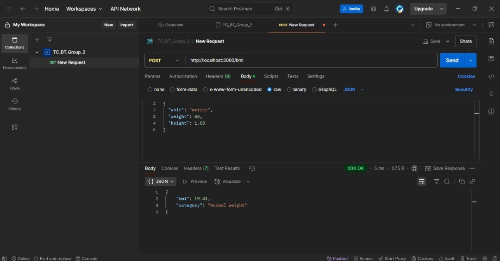
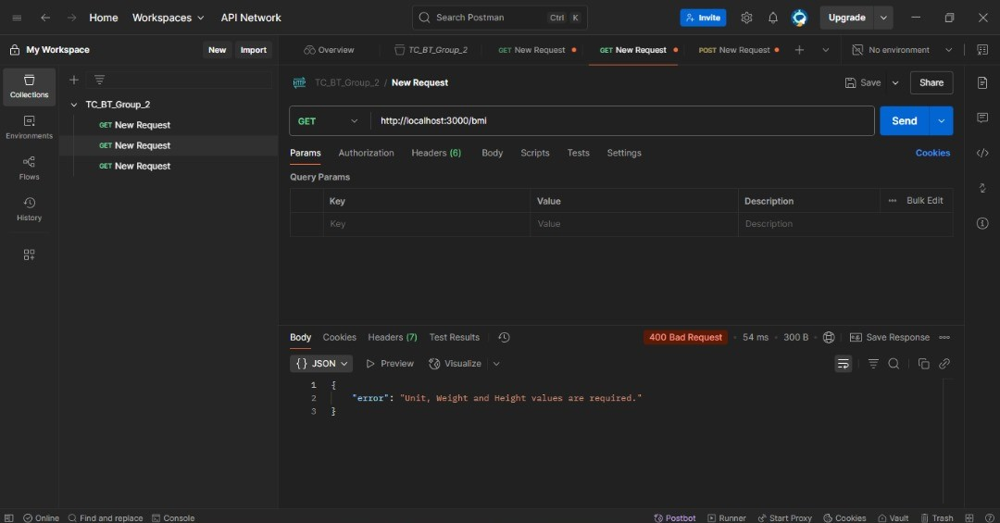
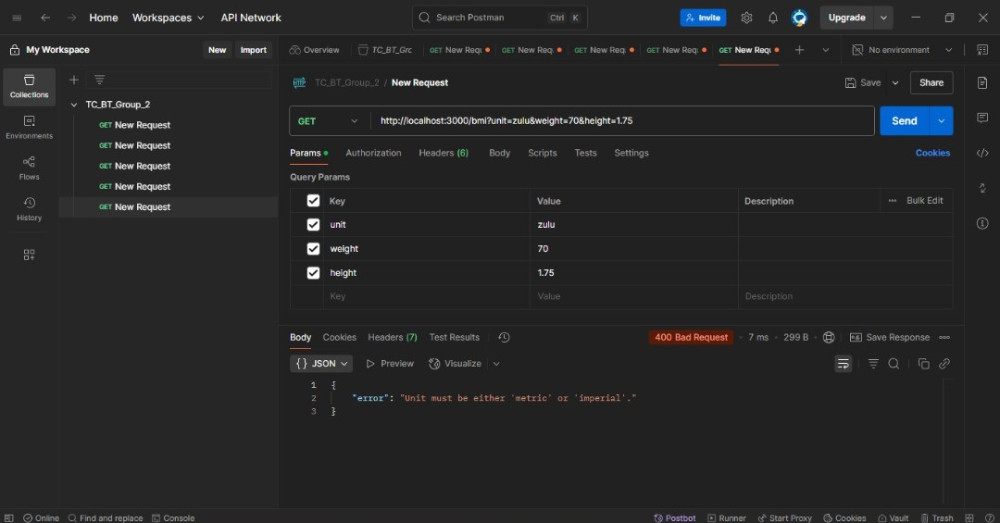
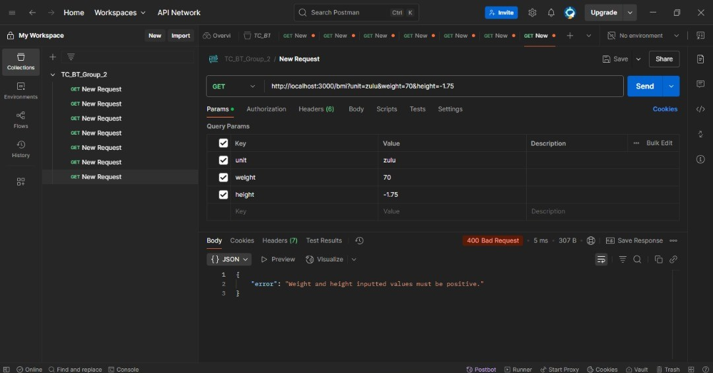
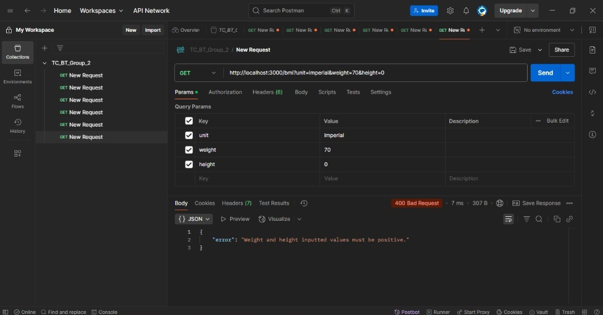
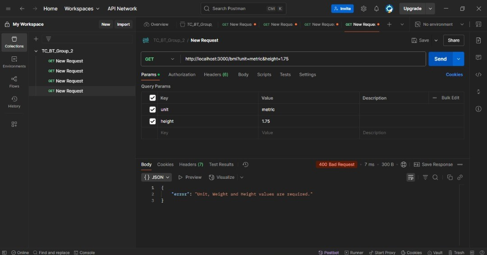

## BMI Calculator
A BMI calculator is a tool used to compute a person's Body Mass Index (BMI), which is a simple numerical value that helps assess whether someone has a healthy body weight for their height.

## Overview
This BMI Calculator API is a tool built using **Node.js** and **Express**. It allows users to calculate their Body Mass Index (BMI) using weight and height inputs and returns both the BMI value and the corresponding health category.

## What the Project Does
- Accepts unit, height, and weight as inputs 
- Calculates BMI using the standard formula
- Returns both the BMI value and the health category (e.g., Normal weight, Overweight)
- Supports **GET** and **POST** requests

## Features
- Includes input validation and structured error handling
- Modular code structure for scalability
- Deployed online for live testing


## BMI Formula

- **Metric units**:  
  
  BMI = weight (kg) / (height (m))^2
  

- **Imperial units**:  
  
  BMI = weight (lb) * 703 / (height (in))^2
  

**Example**:  
If a person weighs 70 kg and is 1.75 m tall:  
BMI = 70 / (1.75 × 1.75) = **22.86**

---

## BMI Categories (WHO Standard)

| BMI Range      | Category       |
|----------------|----------------|
| Below 18.5     | Underweight    |
| 18.5 – 24.9    | Normal weight  |
| 25.0 – 29.9    | Overweight     |
| 30.0 and above | Obese          |


## Installation
To run the project locally:
1. **Clone the repository**:

```bash
git clone https://github.com/mo-renike/TC_BT_Group_2.git

```
2. **Navigate into the project directory**:
cd TC_BT_Group_2
3. **Install dependencies**:
```bash
npm install
```
4. **Start the development server:**
```bash
npm start
```
5. **The server will run on**:
```bash
http://localhost:3000
```
## API Usage
- GET `/bmi`
- **Example Request:**
```bash

GET /bmi?unit=imperial&weight=70&height=1.75

```
**Response:**
```bash
{
  "bmi": 22.86,
  "category": "Normal weight"
}
```
- POST `/bmi`
Request Body:
```bash
{
  "unit": "imperial",
  "weight": 70,
  "height": 1.75
}
```
**Response:**
```bash
{
  "bmi": 22.86,
  "category": "Normal weight"
}
```
## Error Handling
- The API returns a `400 Bad Request` response for missing or invalid inputs.
- **Example Error Response:**
```bash
{
  "error": "Invalid input: weight and height must be positive numbers."
}
```
## Testing
- Used Postman to test the BMI calculation API for both `GET` and `POST` requests.

| Test Case             | Description                            | Sample Input (JSON)                                         | Expected Result                                      | Screenshot                                                                    |
| --------------------- | -------------------------------------- | ----------------------------------------------------------- | ---------------------------------------------------- | ----------------------------------------------------------------------------- |
| ✅ **Correct Fields**  | Valid `metric` input with correct data | `{ "unit": "metric", "weight": 65, "height": 1.83 }`        | `bmi: 19.41`, category: `"Normal weight"`            |   |
| ❌ **Empty Fields**    | All fields empty or blank strings      | `{ "unit": "", "weight": "", "height": "" }`                | `400 Bad Request`: Unit, weight and height are required               |     |
| ❌ **Invalid Values**  | Weight or height is not a number       | `{ "unit": "metric", "weight": "heavy", "height": "tall" }` | `400 Bad Request`: Weight and height must be numbers |   |
| ❌ **Invalid Unit**    | Unit is not `metric` or `imperial`     | `{ "unit": "abc", "weight": 70, "height": 1.75 }`           | `400 Bad Request`: Unit must be either `metric` or `imperial`                 |     |
| ❌ **Negative Values** | Negative weight or height              | `{ "unit": "metric", "weight": -70, "height": 1.75 }`       | `400 Bad Request`: Weight and height inputted values must be positive    |  |
| ❌ **Zero Values**     | Zero weight or height                  | `{ "unit": "metric", "weight": 0, "height": 0 }`            | `400 Bad Request`: Weight and height inputted values must be positive    |      |
| ❌ **Missing Values**  | Missing `weight` field                 | `{ "unit": "metric", "height": 1.75 }`                      | `400 Bad Request`: Unit, weight and height are required               |    |


## Deployment
- Deployed using Render / Vercel / Railway
- Visit the live endpoints using the same GET or POST methods